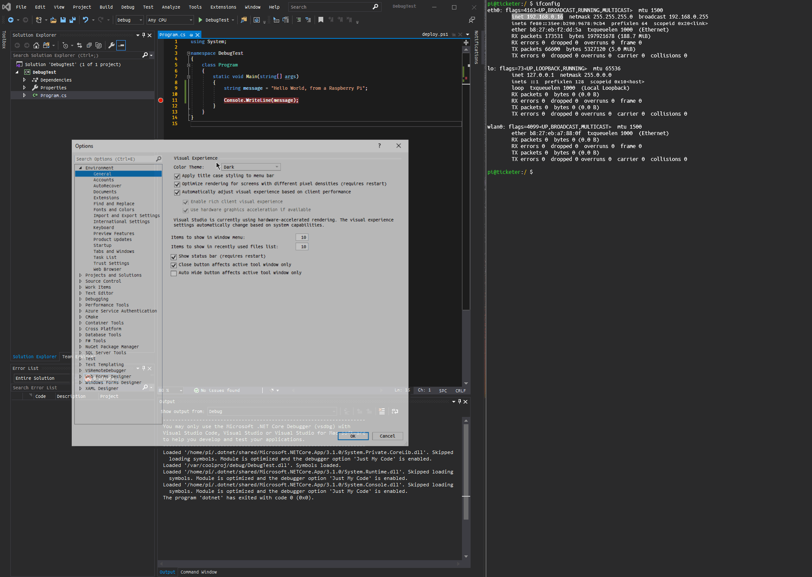

# VSRemoteDebugger
Remote SSH Debugging tool for Visual Studio 2019 (ARM/Raspberry Pi compatible)

## Usage guide

- SSH based authentification needs to be set up between local and remote. Follow the following guide:
https://www.onmsft.com/how-to/how-to-generate-an-ssh-key-in-windows-10

	Rename the private key on the local machine as `~\.ssh\id_rsa`
	Rename the public key on the remote machine as `~/.ssh/authorized_keys`

Make sure the keys are working before proceeding!!
- Install this extension
- In Visual Studio go to `Tools -> Options -> VsRemoteDebugger -> Remote Machine Settings` and modify the access settings
- In Visual Studio go to `Tools -> (click on) Start Remote Debugger`

## The extension performs the following steps:

1. Builds the solution in Visual Studio 
2. Creates the necessary file structure on the remote machine
3. (optional) if running for the first time, installs Visual Studio's vsdbg debugging server on the remote machine
4. Copies the files from the output folder into the remote machine
5. Connects to the VsDbg server and starts debugging the current project via SSH

## Limitations

- Remote debugging only available for ARM-based machines (for now)
- Visual feedback is poor when running for the first time
- Not tested (and most likely not working) for 32-bit versions of Windows
- SSH keys need to be located in the folders specified above (for now)

## Publish vs Build

In a nutshell, if you have a web project (Blazor, ASP .NET) that requires a static assets folder (`wwwroot`) then enable publishing (`Tools -> Settings -> VsRemoteDebugger -> Local Machine Settings -> set publish to true`). 

Publishing is performed by invoking an external console and executing `dotnet publish` in the context of the current solution. This had to be done this way due to some inherit problems in Visual Studio's API.

By default the publish flag is set to false, in which case we're programatically triggering a Build using Visual Studio's API. This method is more robust, but does not copy the static assets required for web projects. 

## Demo

